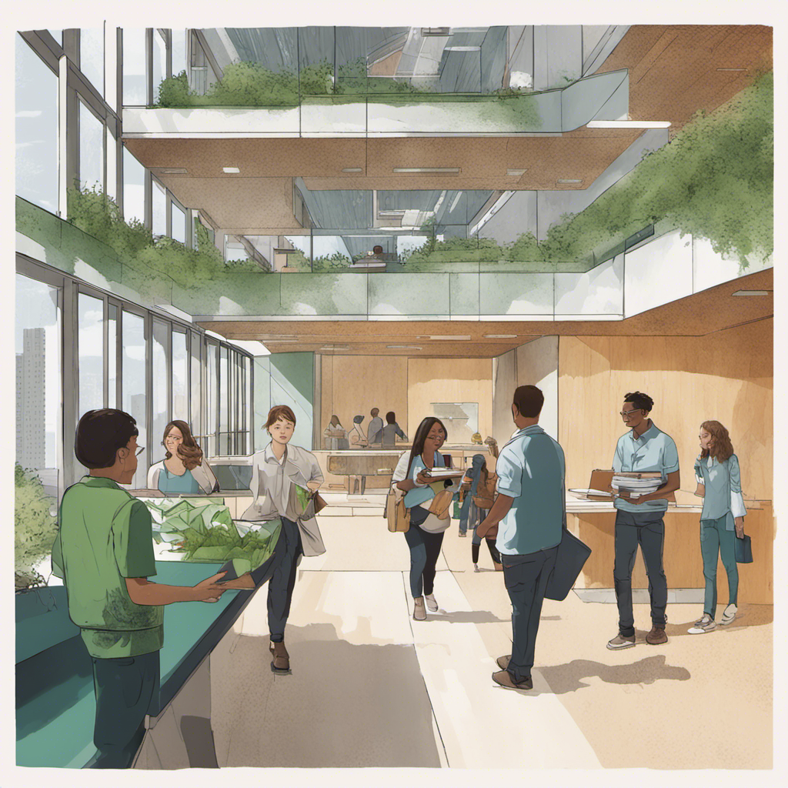

Prompt: Vul de onderstaande Shownotes Template aan met de volgende Input. 

Input: Variabelen:
Het dubbele vraagteken "??" is het cijfer van de aflevering, vervang door "07" . 
Drie vraagtekens "???" is een kort woord dat gebruikt wordt in de bestandsnaam, vervang door "es" . 
Drie vraagtekens en een uitroepteken "???!" is een slur dat gebruikt wordt in het pad, vervang door "education_support" .
Waar vier vraagtekens "????" staan vul daar het onderwerp in van de aflevering, vervang door "Education Support" .
Waar vijf vraagtekens "?????" staan vul daar tekst in die nodig is om de zin ervoor af te maken, op basis van de Input Samenvatting.
Bij Duration staat "??:??:??", dat is de duur van de aflevering, vervang door "00:43:45" .
Bij Publication date staat "YYYY-MM-DD", dat is de publicatie datum van de podcast, vervang door "2023-03-26"
Bij Description, maak een uitgebreide beschrijving. Gebruik html links in de tips en referenties. Gebruik html un-numbered lists in de kernpunten en de referenties.

Input: Samenvatting:

# Samenvatting : Toekomst van Education Support

## Managementsamenvatting

Het interview richt zich op de essentiële thema's en inzichten die zijn besproken over de **toekomst van onderwijsondersteuning binnen universiteitsbibliotheken**. De discussie benadrukt de noodzaak van innovatie in het licht van technologische ontwikkelingen en veranderende onderwijslandschappen. Kernpunten zijn de rol van technologie in het onderwijs, de invloed van historische, huidige en toekomstige factoren op onderwijsondersteuning, en de essentie van onderwijs gericht op menselijke ontwikkeling en inspiratie. 
Het debat onderstreept het belang van het **heroverwegen van educatieve waarden en methoden**, met een **focus op authenticiteit**, **persoonlijke ontwikkeling**, en het **ondersteunen van positieve menselijke eigenschappen door technologie**. Daarnaast wordt de cruciale rol van menselijke interactie binnen het onderwijsproces benadrukt, waarbij **technologie dient ter ondersteuning** en niet als primaire focus.

## Inleiding

- **Podcast Introductie:** Maurice Vanderfeesten introduceert UB 2030, gericht op innovatie in universiteitsbibliotheken door veranderende technologie en onderwijs.
- **Discussiethema:** David Oldenhof benadrukt het gesprek over de toekomst van onderwijsondersteuning.
- **Kernvragen:** Er worden vragen gesteld over het ideale toekomstbeeld voor onderwijsondersteuning en de factoren die veranderingen teweegbrengen.
- **Gasten:** Cees van Gent en Rens van der Vorst worden voorgesteld als experts in onderwijsondersteuning en technofilosofie.

Deze sectie zet het toneel voor een diepgaand gesprek over de toekomst van onderwijsondersteuning, rekening houdend met de uitdagingen en kansen die technologische ontwikkelingen en onderwijsveranderingen met zich meebrengen. Is er nog een ander deel van het transcript dat je wilt samenvatten?

## Definities en Aanleiding

- **Rol van een technofilosoof:** Rens van der Vorst, als technofilosoof, overdenkt de impact van technologie op het leven en het streven naar een betere wereld door betere technologie.
- **Onderwijs en technologie:** Discussies over hoe technologie kan bijdragen aan het vormen van betere mensen en de uitdagingen in het onderwijs door technologische vooruitgang.
- **Innovatieve onderwijsopdrachten:** Voorbeelden van hoe studenten worden uitgedaagd met praktische opdrachten, zoals het ontwerpen van een menselijker alternatief voor CAPTCHA.

Deze samenvatting belicht de belangrijkste punten van discussie over de toekomst van onderwijsondersteuning en de rol van technologie in het verbeteren van onderwijsprocessen. Is er nog een ander deel van het transcript dat je samengevat wilt hebben?

## Toekomst Driehoek - Uitleg

- **Toekomstdriehoek als instrument:** Maurice introduceert de toekomstdriehoek, ontwikkeld door Sohail Inayatullah, als een methode om het verleden, heden, en toekomst te analyseren en om waarschijnlijke toekomsten te verkennen.
- **Drie dimensies:** De toekomstdriehoek bestaat uit het gewicht van het verleden, de druk van het heden, en de aantrekkingskracht van de toekomst, waarbij de interactie tussen deze drie krachten de toekomstige ontwikkelingen vormgeeft.
- **Focus op het heden:** Het heden wordt benadrukt als vol van veranderingsfactoren, variërend van politiek, sociaal, geopolitiek, technologisch tot economisch, die allemaal invloed hebben op de toekomst van onderwijsondersteuning.

Deze samenvatting illustreert hoe de toekomstdriehoek wordt gebruikt om de complexe dynamiek tussen verleden, heden, en toekomst te begrijpen en hoe deze de richting van onderwijsondersteuning kan beïnvloeden. Is er nog een ander deel van het transcript dat je samengevat wilt hebben?

## Toekomst Driehoek - Druk van het Heden

- **Impact van technologie:** Er wordt een vergelijking gemaakt met de exponentiële groei van technologische ontwikkelingen en hoe deze soms als overdreven wordt ervaren. De nadruk ligt op het belang van het begrijpen van de impact van nieuwe technologieën zoals audiovisuele middelen.
- **Historisch perspectief:** Een oproep om te leren van het verleden en hoe eerdere technologische doorbraken, zoals de stoommachine en telefonie, vergelijkbare sociale reacties uitlokten.
- **Investeringen in onderwijstechnologie:** Een kritische blik op de gigantische investeringen in technologie door onderwijsinstellingen en het ontbreken van zichtbare verbeteringen in kernindicatoren zoals studententevredenheid, studietempo, en docentenwerklast.
- **Rol van nieuwe technologieën:** Besproken wordt hoe technologieën zoals smartphones en AI zwaktes in het onderwijssysteem blootleggen, zoals de nadruk op certificering boven leren.
- **Studenten als ontwikkelaars:** Het potentieel van studenten om bij te dragen aan de ontwikkeling van onderwijstechnologieën en de behoefte aan een herdefinitie van studentenondersteuning in het licht van nieuwe technologieën.

Deze samenvatting belicht de complexe interactie tussen huidige technologische ontwikkelingen en het onderwijssysteem, en roept op tot een heroverweging van hoe technologie kan bijdragen aan een meer authentieke en effectieve leerervaring. Is er nog een ander deel van het transcript dat je samengevat wilt hebben?

## Toekomst Driehoek - Aantrekkingskracht van de Toekomst

- **Terug naar de essentie van onderwijs:** Rens van der Vorst benadrukt het belang van leren boven certificeren, en stelt voor dat onderwijs zich meer moet richten op het vergaren van kennis dan op het behalen van diploma's.
- **Flexibiliteit in leren:** Het idee wordt geopperd dat studenten zelf kunnen bepalen hoe lang ze studeren en wat ze leren, waardoor onderwijs meer gepersonaliseerd en relevant wordt.
- **Rol van onderwijsinstellingen:** Er wordt gereflecteerd op de waarde van onderwijsinstellingen in dit toekomstbeeld, met nadruk op hun rol in het faciliteren van ontmoetingen, het bieden van fysieke ruimtes, en het helpen van studenten met hun persoonlijke ontwikkeling.
- **Technologie ter ondersteuning van goede eigenschappen:** De noodzaak voor een betere inzet van technologie wordt besproken, waarbij technologieën die positieve menselijke eigenschappen versterken worden geprefereerd boven technologieën die negatieve gedragingen aanmoedigen.

Deze samenvatting belicht de wens voor een onderwijssysteem dat zich meer richt op authentiek leren en persoonlijke ontwikkeling, met een ondersteunende rol voor zowel onderwijsinstellingen als technologie.

## Toekomst Driehoek - Gewicht van het Verleden

- **Focus op materiële winst:** De discussie benadrukt hoe het huidige onderwijssysteem en de samenleving vaak meer gericht zijn op financiële winst dan op geestelijke en sociale verrijking.
- **Vroege druk op jongeren:** Er wordt opgemerkt dat jongeren al op een zeer jonge leeftijd belangrijke keuzes moeten maken die hun toekomstige loopbaan beïnvloeden, wat wordt gezien als deel van het probleem.
- **Mensbeeld in onderwijs:** De aannames over studenten en het gebruik van technologie in het onderwijs worden kritisch bekeken, met name de nadruk op controle en het voorkomen van valsspelen, in plaats van op inspiratie en positieve ontwikkeling.
- **Waarde van academisch onderwijs:** Er wordt gereflecteerd op de waarde en de toekomst van academisch onderwijs in het licht van alternatieve leerpaden en de nadruk op modulaire onderwijsvormen en levenslang leren.
- **Onderwijs als mensenwerk:** Het belang van menselijke interactie in het onderwijs wordt benadrukt, met een pleidooi voor meer focus op de relatie tussen studenten en docenten, en minder op technologie voor efficiëntie.

Deze samenvatting belicht de historische en huidige uitdagingen in het onderwijssysteem en roept op tot een heroverweging van waarden en methoden, met de nadruk op menselijke ontwikkeling en inspiratie.

## Tips van de Gasten

- **Belang van onderwijs:** Cees van Gent benadrukt dat onderwijs draait om liefde, warmte, en aandacht, en het belang van het zien van mensen. Technologie moet deze elementen ondersteunen zonder de essentie te vergeten.
- **Aanbevolen leesmateriaal:** Rens van der Vorst promoot zijn boek "Digitale gremlins", dat gaat over hoe we ons kunnen onttrekken aan de greep van algoritmen in onze zoektocht om betere mensen te worden.

Deze samenvatting belicht de kernwaarden die essentieel zijn voor het onderwijs en biedt een leestip die relevant is voor de huidige technologische samenleving.

## Referenties Toekomst van Education Support

* NPULS. (n.d.). Npuls. Retrieved August 23, 2023, from https://npuls.nl/
* Tech Trends | SURF.nl. (n.d.). Retrieved August 23, 2023, from https://www.surf.nl/en/tech-trends
* Tool advice – VU Education Lab Knowledge Base. (n.d.). Retrieved August 23, 2023, from https://vu-ctl.nl/en/index.php/tool-advisor/
* Toolpicker: VU tools for Education. (n.d.). Retrieved August 23, 2023, from https://canvas.vu.nl/courses/47759/pages/toolpicker
* Vorst, R. van der. (2023). Digitale gremlins: Slimme sabotages om je te onttrekken aan de greep van het algoritme. Uitgeverij Business Contact. https://www.digitalegremlins.nl/
* VU Onderwijswerkplaats. (n.d.). Vrije Universiteit Amsterdam. Retrieved August 23, 2023, from https://vu.nl/nl/onderwijs/vu-onderwijswerkplaats
* VU tools for Education. (n.d.). Retrieved August 23, 2023, from https://canvas.vu.nl/courses/47759

Input: Shownotes Template:

# UB2030 - ?? - Toekomst van ????
*SHOW NOTES*

[Episode Page](https://ubvu.github.io/ub2030/ub2030-??-???) | [Project Page](https://ubvu.github.io/ub2030/) | [Listen on SoundCloud](https://soundcloud.com/vu-library-live/sets/ub2030-the-future-of-research-libraries) | [Podcast RSS](https://feeds.soundcloud.com/users/soundcloud:users:527805591/sounds.rss)

<iframe width="100%" height="166" scrolling="no" frameborder="no" allow="autoplay" src="https://w.soundcloud.com/player/?url=https%3A//api.soundcloud.com/tracks/1667530074%3Fsecret_token%3Ds-gscTtK4QLNq&color=%230077b3&auto_play=false&hide_related=false&show_comments=true&show_user=true&show_reposts=false&show_teaser=true"></iframe>
<a href="https://soundcloud.com/vu-library-live" title="VU Library Live" target="_blank" style="color: #cccccc; text-decoration: none;">VU Library Live</a> · <a href="https://soundcloud.com/vu-library-live/ub2030-education_support/s-gscTtK4QLNq" title="UB2030 - Education Support" target="_blank" style="color: #cccccc; text-decoration: none;">UB2030 - Education Support</a>

## Basic Info

Field Name       | Field Value    
---|---
Cover Image            |     <https://github.com/ubvu/ub2030/blob/main/ub2030-??-???!/ub2030-??-???-cover_image.jpg>
Title            | UB2030 - Toekomst van ????
Permalink        | ub2030-???! 
Genre            | Science
Tags             | #Podcast #UB2030 #Libraries #Futuring #????
Description      | UB 2030 is een podcast over de innovatie van de universiteitsbibliotheek door technologische veranderingen en verschuivingen in onderzoek en onderwijs. In deze aflevering bespreken David Oldenhof en Maurice Vanderfeesten het onderwerp ????. Ze worden vergezeld door de gasten (beschrijf de naam, functie en organisatie) ?????.      **Samenvatting:**   De podcast bespreekt het belang van ?????. en het lonkende perspectief waarbij ?????    **Kernpunten:**  De meest opvallende zaken die besproken werden zijn: ????     **Tips van de gasten:**   De gasten hebben de volgende tips voor de luisteraars ?????     **Referenties:**   De volgende referentielijst is voor deze aflevering verzameld: ????
Privacy          | Public
Publication date | YYYY-MM-DDT12:00:00 CET
Duration         | ??:??:??
Audio            | <https://github.com/ubvu/ub2030/blob/main/ub2030-??-???!/ub2030-??-???-audio.m4a>
Shownotes        | <https://ubvu.github.io/ub2030/ub2030-??-???>
Transcript       | <https://github.com/ubvu/ub2030/blob/main/ub2030-??-???!/ub2030-??-???-transcript.md>
Summary          | <https://github.com/ubvu/ub2030/blob/main/ub2030-??-???!/ub2030-??-???-gpt4-step1-summary.md>
Perspective      | <https://github.com/ubvu/ub2030/blob/main/ub2030-??-???!/ub2030-??-???-gpt4-step2-perspective.md>
Story      | <https://github.com/ubvu/ub2030/blob/main/ub2030-??-???!/ub2030-??-???-gpt4-step2-story_scenario.md>
Next Steps       | <https://github.com/ubvu/ub2030/blob/main/ub2030-??-???!/ub2030-??-???-gpt4-step3-next_steps.md>
References       | <https://github.com/ubvu/ub2030/blob/main/ub2030-??-???!/ub2030-??-???-references.md>
Feedback         | <https://forms.office.com/e/KX08BEenpu>

## Extended Info

  Field Name                 | Field Value 
  --------------------------  | -------------------------------------------------------------------
  Contains music              | No
  Artist                      | Universiteitsbibliotheek Vrije Universiteit Amsterdam
  Publisher                   | Universiteitsbibliotheek Vrije Universiteit Amsterdam
  Composer                    | \-
  Release title               | \-
  Buy-link                    | <https://ubvu.github.io/ub2030/>
  Album title                 | UB2030
  Record label                | \-
  Release date                | \-
  Barcode                     | \-
  Contains explicit content   | No
  License                     | CC-BY (Creative Commons, Attribution, version 4.0, International)

## Permissions

  Field Name               | Field Value
  -------------------------| -------------
  Enable direct downloads  | Yes
  Offline listening        | Yes
  Include in RSS feed      | Yes
  Display embed code       | Yes
  Enable appl playback     | Yes
                            

## Advanced

  Field Name         | Field Value
  -------------------| --------------------
  20 second Preview  | Starting at: 00:00

Output:
------

# UB2030 - 07 - Toekomst van es
*SHOW NOTES*

[Episode Page](https://ubvu.github.io/ub2030/ub2030-07-es) | [Project Page](https://ubvu.github.io/ub2030/) | [Listen on SoundCloud](https://soundcloud.com/vu-library-live/sets/ub2030-the-future-of-research-libraries) | [Podcast RSS](https://feeds.soundcloud.com/users/soundcloud:users:527805591/sounds.rss)

<iframe width="100%" height="166" scrolling="no" frameborder="no" allow="autoplay" src="https://w.soundcloud.com/player/?url=https%3A//api.soundcloud.com/tracks/1667530074%3Fsecret_token%3Ds-gscTtK4QLNq&color=%230077b3&auto_play=false&hide_related=false&show_comments=true&show_user=true&show_reposts=false&show_teaser=true"></iframe>
<a href="https://soundcloud.com/vu-library-live" title="VU Library Live" target="_blank" style="color: #cccccc; text-decoration: none;">VU Library Live</a> · <a href="https://soundcloud.com/vu-library-live/ub2030-education_support/s-gscTtK4QLNq" title="UB2030 - Education Support" target="_blank" style="color: #cccccc; text-decoration: none;">UB2030 - Education Support</a>

## Basic Info

Field Name       | Field Value    
---|---
Cover Image            |     <https://github.com/ubvu/ub2030/blob/main/ub2030-07-education_support/ub2030-07-es-cover_image.jpg>
Title            | UB2030 - Toekomst van Education Support
Permalink        | ub2030-education_support 
Genre            | Science
Tags             | #Podcast #UB2030 #Libraries #Futuring #EducationSupport
Description      | UB 2030 is een podcast over de innovatie van de universiteitsbibliotheek door technologische veranderingen en verschuivingen in onderzoek en onderwijs. In deze aflevering bespreken David Oldenhof en Maurice Vanderfeesten het onderwerp Education Support. Ze worden vergezeld door de gasten Cees van Gent en Rens van der Vorst, experts in onderwijsondersteuning en technofilosofie.      **Samenvatting:**   De podcast bespreekt het belang van het heroverwegen van educatieve waarden en methoden, met een focus op authenticiteit, persoonlijke ontwikkeling, en het ondersteunen van positieve menselijke eigenschappen door technologie.     **Kernpunten:**  De meest opvallende zaken die besproken werden zijn: de rol van technologie in onderwijs, de invloed van historische, huidige en toekomstige factoren op onderwijsondersteuning, en de cruciale rol van menselijke interactie in het leerproces.     **Tips van de gasten:**   Cees van Gent benadrukt het belang van onderwijs dat draait om liefde, warmte, en aandacht. Rens van der Vorst promoot zijn boek "Digitale gremlins".     **Referenties:**   De volgende referentielijst is voor deze aflevering verzameld: [NPULS](https://npuls.nl/), [Tech Trends | SURF.nl](https://www.surf.nl/en/tech-trends), [Tool advice – VU Education Lab Knowledge Base](https://vu-ctl.nl/en/index.php/tool-advisor/), [Toolpicker: VU tools for Education](https://canvas.vu.nl/courses/47759/pages/toolpicker), [Digitale gremlins door

Rens van der Vorst](https://www.digitalegremlins.nl/), [VU Onderwijswerkplaats](https://vu.nl/nl/onderwijs/vu-onderwijswerkplaats), [VU tools for Education](https://canvas.vu.nl/courses/47759).
Privacy          | Public
Publication date | 2023-03-26T12:00:00 CET
Duration         | 00:43:45
Audio            | <https://github.com/ubvu/ub2030/blob/main/ub2030-07-education_support/ub2030-07-es-audio.m4a>
Shownotes        | <https://ubvu.github.io/ub2030/ub2030-07-es>
Transcript       | <https://github.com/ubvu/ub2030/blob/main/ub2030-07-education_support/ub2030-07-es-transcript.md>
Summary          | <https://github.com/ubvu/ub2030/blob/main/ub2030-07-education_support/ub2030-07-es-gpt4-step1-summary.md>
Perspective      | <https://github.com/ubvu/ub2030/blob/main/ub2030-07-education_support/ub2030-07-es-gpt4-step2-perspective.md>
Story      | <https://github.com/ubvu/ub2030/blob/main/ub2030-07-education_support/ub2030-07-es-gpt4-step2-story_scenario.md>
Next Steps       | <https://github.com/ubvu/ub2030/blob/main/ub2030-07-education_support/ub2030-07-es-gpt4-step3-next_steps.md>
References       | <https://github.com/ubvu/ub2030/blob/main/ub2030-07-education_support/ub2030-07-es-references.md>
Feedback         | <https://forms.office.com/e/KX08BEenpu>

## Extended Info

  Field Name                 | Field Value 
  --------------------------  | -------------------------------------------------------------------
  Contains music              | No
  Artist                      | Universiteitsbibliotheek Vrije Universiteit Amsterdam
  Publisher                   | Universiteitsbibliotheek Vrije Universiteit Amsterdam
  Composer                    | \-
  Release title               | \-
  Buy-link                    | <https://ubvu.github.io/ub2030/>
  Album title                 | UB2030
  Record label                | \-
  Release date                | \-
  Barcode                     | \-
  Contains explicit content   | No
  License                     | CC-BY (Creative Commons, Attribution, version 4.0, International)

## Permissions

  Field Name               | Field Value
  -------------------------| -------------
  Enable direct downloads  | Yes
  Offline listening        | Yes
  Include in RSS feed      | Yes
  Display embed code       | Yes
  Enable appl playback     | Yes
                            

## Advanced

  Field Name         | Field Value
  -------------------| --------------------
  20 second Preview  | Starting at: 00:00
